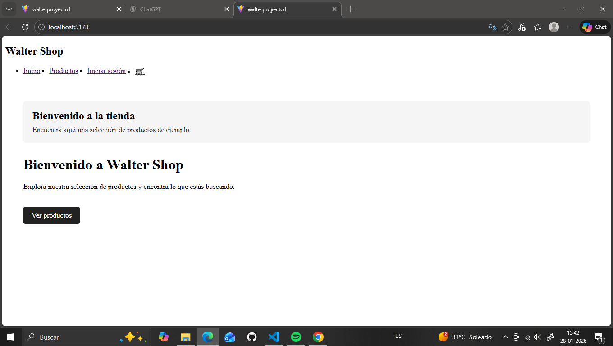
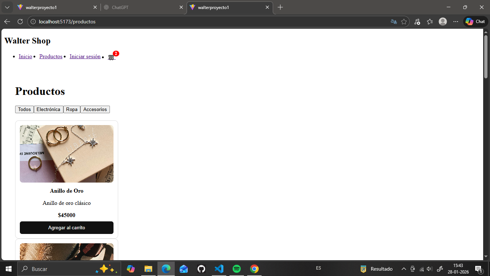
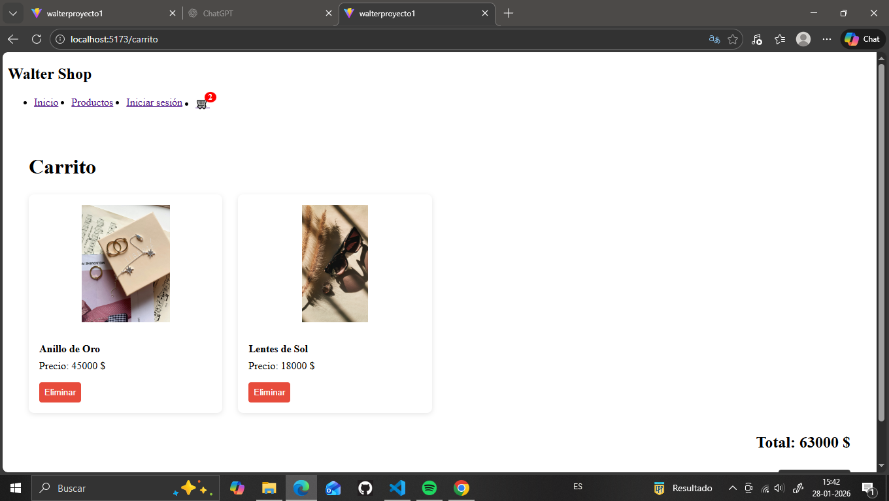
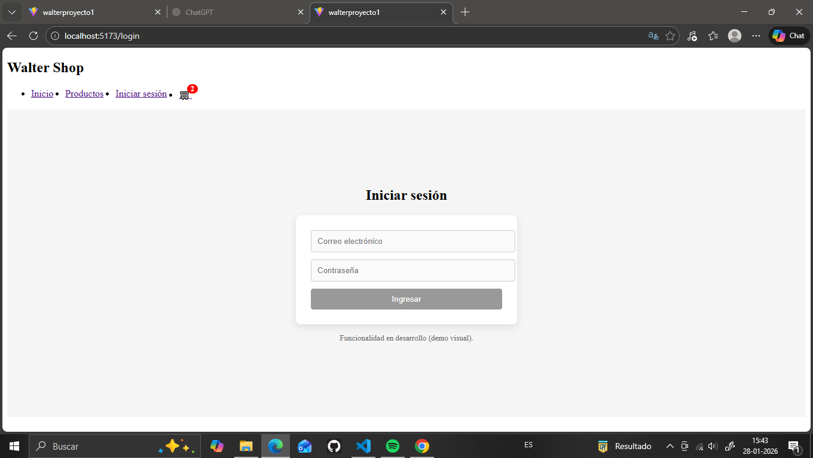

# 🛒 Proyecto E-commerce Full Stack (React + Node + MongoDB)

##  Descripción

Este proyecto es una **aplicación de e-commerce full stack** desarrollada como práctica académica y **proyecto de portfolio personal**.

El objetivo principal fue construir una aplicación completa separando correctamente **frontend y backend**, aplicando buenas prácticas, manejo de estado, ruteo, persistencia de datos y simulación de autenticación.

---

##  Funcionalidades

### Frontend
- Listado de productos por categoría
- Filtros (Electrónica / Ropa / Accesorios)
- Carrito de compras:
  - Agregar productos
  - Eliminar productos
  - Vaciar carrito
  - Persistencia en `localStorage`
- Contador de carrito (badge en navbar)
- Login simulado (auth mock)
- Navegación con React Router
- Diseño responsive básico

### Backend
- API REST con Node.js y Express
- CRUD de productos
- Conexión a base de datos MongoDB
- Modelo de productos con Mongoose
- Separación por rutas, controladores y modelos

---

## Tecnologías utilizadas

### Frontend
- React
- Vite
- React Router DOM
- Context API
- JavaScript (ES6+)
- HTML5 / CSS3
- LocalStorage

### Backend
- Node.js
- Express
- MongoDB
- Mongoose
- dotenv
- CORS

---

##  Estructura del proyecto

proyecto-ecommerce/
│
├── backend/
│ ├── config/
│ ├── models/
│ ├── routes/
│ ├── controllers/
│ ├── server.js
│
├── src/
│ ├── assets/
│ │ └── images/
│ ├── components/
│ ├── context/
│ ├── data/
│ ├── pages/
│ ├── App.jsx
│ ├── main.jsx
│
├── package.json
├── vite.config.js


---

## ▶ Cómo ejecutar el proyecto

### Requisitos
- Node.js instalado
- MongoDB (local o Atlas)


---

## ▶️ Cómo ejecutar el proyecto

### Requisitos
- Node.js instalado
- MongoDB (local o Atlas)

### Frontend
```bash
npm install
npm run dev

### abrir el navegador
http://localhost:5173

###  Backend

cd backend
npm install
npm run dev

### servidor

http://localhost:3000

## 🖼 Capturas del proyecto

### Home


### Productos


### Carrito


### Login


Listado de productos

Filtro por categorías

Carrito de compras:

Agregar productos

Eliminar productos

Vaciar carrito

Persistencia en localStorage

Login simulado

Navegación con React Router

Backend con API REST

Conexión a MongoDB


### Aprendisaje

Manejo de estado global con Context API

Consumo de APIs

Arquitectura frontend / backend

Modelado de datos con Mongoose

Organización de proyectos Full Stack

Buenas prácticas de React


👤 Autor

Walter Ghisolfo
Desarrollador Frontend / Full Stack Jr

Proyecto realizado con fines educativos y de portfolio.